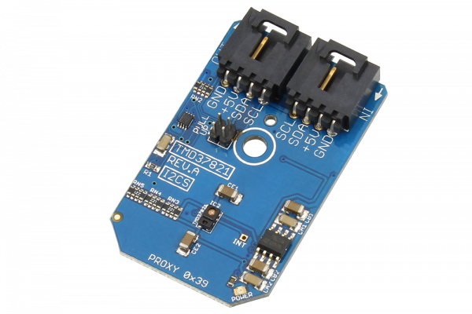

# TMD37821

The TMD37821is a color light-to-digital converter that performs color temperature measurement, ambient light sensing (ALS) and proximity detection with background light rejection.This device is able to detect light through dark glass along with other objects that have a gradual loss in light intensity.
This Device is available from www.ncd.io 

[SKU: TMD37821_I2CS]

(https://store.ncd.io/product/tmd37821-color-light-to-digital-converter-with-proximity-sensing-i2c-mini-module/)
This Sample code can be used with Arduino.

Hardware needed to interface TMD37821 sensor with Arduino

1. <a href="https://store.ncd.io/product/i2c-shield-for-arduino-nano/">Arduino Nano</a>

2. <a href="https://store.ncd.io/product/i2c-shield-for-arduino-micro-with-i2c-expansion-port/">Arduino Micro</a>

3. <a href="https://store.ncd.io/product/i2c-shield-for-arduino-uno/">Arduino uno</a>

4. <a href="https://store.ncd.io/product/dual-i2c-shield-for-arduino-due-with-modular-communications-interface/">Arduino Due</a>

5. <a href="https://store.ncd.io/product/tmd37821-color-light-to-digital-converter-with-proximity-sensing-i2c-mini-module/">TMD37821 Color Light To Digital converter and Proximity Detector Sensor</a>

6. <a href="https://store.ncd.io/product/i%C2%B2c-cable/">I2C Cable</a>

TMD37821:

The TMD37821is a color light-to-digital converter that performs color temperature measurement, ambient light sensing (ALS) and proximity detection with background light rejection.This device is able to detect light through dark glass along with other objects that have a gradual loss in light intensity.

Applications:

• Mobile Handset Touchscreen Control and Automatic Speakerphone Enable

• Mechanical Switch Replacement

• Paper Alignment

• Digital Signage

How to Use the TMD37821 Arduino Library

The TMD37821 has a number of settings, which can be configured based on user requirements.
          
1.Accessing time setting:The following command is used to set the accessing time of TMD37821 sensor.

             tmd.setATime(ATIME_609MS);           // Cycles: 256, Time: 609 ms Max Count: 65535
            
2.Wait time:The following command is used to set the wait time for sensor.

            tmd.setWTime(WTIME_1);               // Wait Time: 1, Time (WLONG = 0): 2.38 ms Time (WLONG = 1):  0.03 sec
           
3.Proximity drive:The following command is used to set the proximity drive.

             tmd.setProximityDrive(PDRIVE_100);          // LED Strength – PDL=0: 100%, LED Strength – PDL=1: 11.1%
           
4.Proximity output:The following command is used for the output of proximity..             
           
            tmd.setProximityOutput(PSAT_0);             // PDATA Output Regardless of Ambient Light Level
            
5.Color gain setting:The following command is used to set the gain of color.            
            
            tmd.setColorGain(AGAIN_1X);                 // Color Gain: 1X
             
